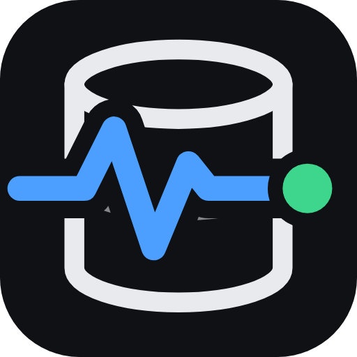
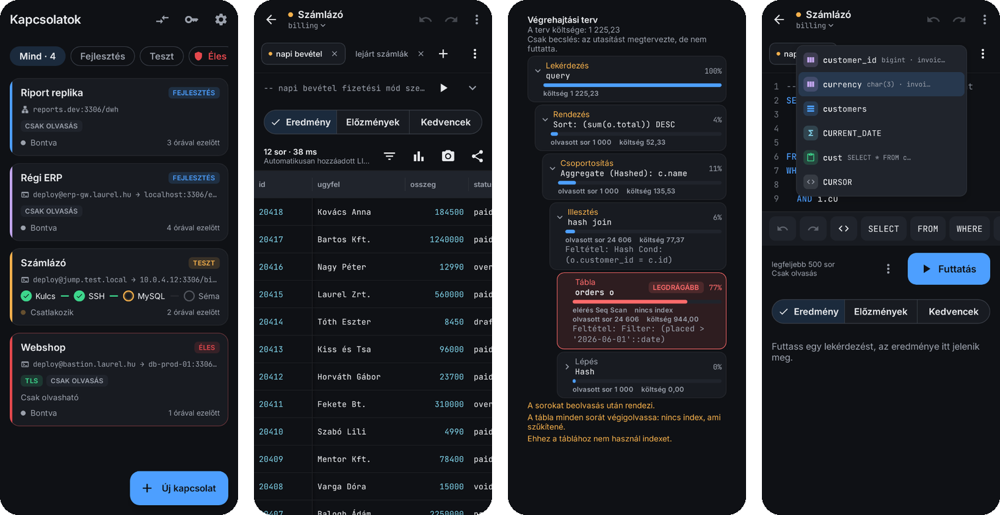
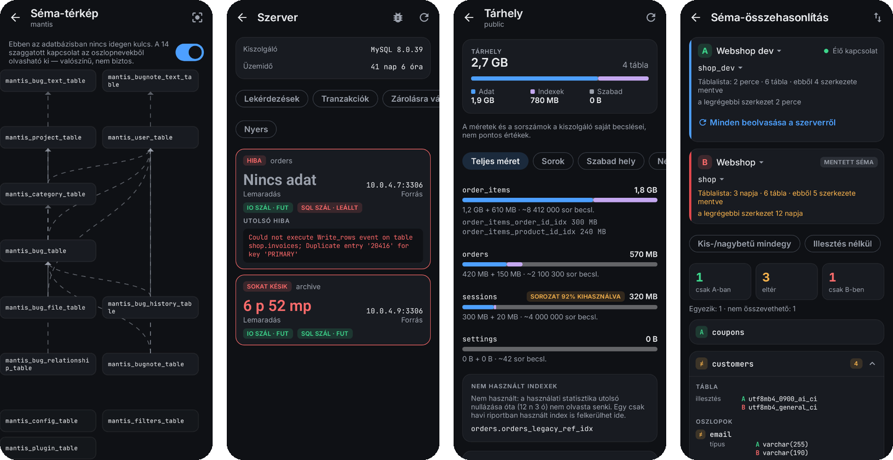

<p align="center">
  
</p>

<h1 align="center">SQLPulse</h1>

<p align="center">
  <b>A careful SQL client for Android — for the moment you have to look at production from your phone.</b>
</p>

<p align="center">
  <a href="https://github.com/zakos/SQLPulse/actions/workflows/android.yml"></a>
  <a href="https://github.com/zakos/SQLPulse/releases"></a>
  
  
  
  
</p>

---

SQLPulse connects to **MySQL / MariaDB, PostgreSQL and Microsoft SQL Server / Azure SQL** — through
an SSH tunnel or directly, plain or over verified TLS — and opens **SQLite files** straight from the
phone. It is built for the person on call: reading is fast, and writing is deliberate. Every write
shows how many rows it will touch and what they look like before it runs, production connections
are locked for writing until you unlock them, and everything that was written is in a local log.

> [Magyar leírás lent ↓](#magyarul)

<p align="center">
  
</p>
<p align="center">
  
</p>

## Contents

- [Highlights](#highlights)
- [Download](#download)
- [Features](#features)
- [Safety first](#safety-first)
- [Privacy](#privacy)
- [Building from source](#building-from-source)
- [Releases and CI](#releases-and-ci)
- [Signing](#signing)
- [Architecture](#architecture)
- [Project layout](#project-layout)
- [Contributing](#contributing)
- [Magyarul](#magyarul)

## Highlights

- **Five engines, one app.** MySQL and MariaDB (down to MySQL 4.1 through an automatic legacy driver), PostgreSQL 12+, SQL Server and Azure SQL, and SQLite files picked from the phone.
- **SSH built in.** Key (OpenSSH, PKCS#8, PEM, on-device Ed25519) or password authentication, jump hosts, host-key pinning, a foreground tunnel that rebuilds itself when the network changes.
- **Writes you can see coming.** Row count and a preview of the affected rows (old → new) before any UPDATE or DELETE; WHERE-less writes refused; production writes locked until unlocked for 15 minutes.
- **A real editor on a phone.** Engine-aware highlighting and a completion popup, a customisable key bar, snippets, unlimited undo/redo, `:parameters`, tabs, history, favourites, sharing.
- **Results that work.** Sticky header and first column, filter, sort, column statistics with outlier detection, charts, in-place editing when the result maps to one table, a snapshot "time machine" that diffs results — even across two connections.
- **Know your server.** Plan tree for EXPLAIN on every engine, running queries with cancel/kill, locks, replication health, slowest statements, live Pulse metrics with alerts, table and index sizes, unused indexes.
- **Know your schema.** Browser with views, routines and triggers, a schema map that also guesses links where there are no foreign keys, database-wide value search, schema comparison between two connections.
- **Fully translated.** English and Hungarian throughout.

## Download

Prebuilt APKs are published on the [Releases](https://github.com/zakos/SQLPulse/releases) page:

- **`nightly`** is a rolling pre-release, rebuilt from every pull request merged into `main`.
- **`v<version>`** is a stable release, created the first time a new version number lands on `main`.

Requires **Android 9.0 (API 28)** or newer. Every build is signed with the same key, so a newer APK
installs over an older one and keeps its connections. (An APK built elsewhere, with another key,
cannot update it — uninstall first, after taking a backup in *Settings → Backup*.)

## Features

<details>
<summary><b>Engines</b></summary>

| | MySQL / MariaDB | PostgreSQL | SQL Server / Azure SQL | SQLite file |
|---|:-:|:-:|:-:|:-:|
| Connect over SSH / directly | ✓ | ✓ | ✓ | — (local file) |
| TLS with CA verification | ✓ | ✓ | ✓ | — |
| Schema browser, DDL | ✓ | ✓ | ✓ (no table DDL) | ✓ |
| Query, edit rows, editable results | ✓ | ✓ | ✓ | ✓ (tables with a key) |
| Write count + row preview | ✓ | ✓ | ✓ | ✓ |
| EXPLAIN plan tree | JSON plan | `EXPLAIN (FORMAT JSON)` | estimated `SHOWPLAN_XML` | `EXPLAIN QUERY PLAN` |
| Database search, storage, schema comparison | ✓ | ✓ | ✓ | ✓ |
| Running queries, locks, replication, slow statements, Pulse, alerts | ✓ | ✓ | ✓ | — |

Drivers: MariaDB Connector/J 3.4 (+ MySQL Connector/J 5.1 for servers older than 5.5.3), pgjdbc 42.7,
mssql-jdbc 13, sqlite-jdbc 3.5x. SQL Server's driver ignores the JDBC read-only flag, so on SQL Server
read-only rests on the app's own guards and on the login's permissions; the editor says so.
</details>

<details>
<summary><b>Editor and results</b></summary>

- Highlighting, completion popup (tables, columns, keywords, functions, snippets), formatter
- Key bar above the keyboard, reorderable and hideable in Settings
- Snippets: built-in per engine, plus your own
- Unlimited undo/redo per tab; tabs; history; favourites with `:parameter` forms
- Automatic row limit on reads (configurable), shown above the result
- Grid with sticky header and first column, resizable columns, filter, sort, cell and row sheets
- Column statistics (count, distinct, sum, average, min/max, quartiles) with outlier highlighting
- Charts from a result; snapshot "time machine" with row-by-row diff, across connections too
- Export to CSV, TSV, JSON, INSERT statements or a Markdown table — the rows on screen, or the full result streamed to a file
- CSV import into a table with manual column mapping, type checks and a preview
</details>

<details>
<summary><b>Server and schema tools</b></summary>

- Running queries with cancel / kill, open transactions, lock waits
- Replication health per channel (MySQL), per standby (PostgreSQL), per AG replica (SQL Server)
- Slowest statements from `performance_schema`, `pg_stat_statements` or `dm_exec_query_stats`, openable in the editor
- Pulse: live metrics per engine, with alert rules that notify while the connection is open
- Storage: table and index sizes, auto-increment / identity headroom, unused and redundant indexes
- Schema map with real and guessed links; foreign-key walking from a row
- Database-wide value search, a hit opens the table filtered to that row
- Schema comparison between two connections: tables, columns, indexes, foreign keys and their rules, CHECK constraints, views, triggers
</details>

## Safety first

- **Production is a state, not a label.** A production connection opens read-only for writes; writing needs an explicit 15-minute unlock, enforced where statements run (editor, row edits, CSV import), not just in the dialog.
- **See before you write.** UPDATE and DELETE show the affected row count and the first rows with their old and new values. A write without WHERE is refused (configurable), and an optional ceiling refuses writes that would touch too many rows.
- **One row means one row.** Row edits run in a transaction and roll back unless exactly one row changed; a value changed by someone else meanwhile is detected, not overwritten. Undo for ten seconds.
- **Nothing hidden.** Every write the app sends — successful or not — goes to a local write log you can filter and export.
- **No schema changes.** DDL, bulk operations and user administration are out of scope on purpose.
- **Host keys are pinned.** A changed SSH host key blocks the connection with a clear warning.

## Privacy

- Nothing leaves the phone except the connections you open. No analytics, no AI services, no cloud.
- Secrets (database and SSH passwords, private keys) are sealed with Android Keystore keys that need user authentication; the local database is encrypted with SQLCipher.
- `FLAG_SECURE` is on by default: no screenshots, no recents preview. Settings can turn it off when you need to report a problem.
- The app locks itself after the configured idle time and tears the tunnel down with it. Exports exist only as cache files handed to the share sheet and are wiped on the next start and on every lock.
- Backups are encrypted with a passphrase you choose; secrets are included only if you ask, one keystore unlock per secret.

## Building from source

Requirements: JDK 17 and an Android SDK with platform 35.

```sh
./gradlew testDebugUnitTest      # unit tests
./gradlew lintDebug              # Android Lint
./gradlew assembleDebug          # debug APK
./gradlew assembleRelease        # minified release APK (signed if the signing variables are set)
./gradlew recordPaparazziDebug   # re-record the screenshot tests in app/src/test/snapshots/images
```

**Integration tests** live under `app/src/test/java/hu/laurel/sqlpulse/integration/` and run against
real servers. They skip themselves unless their environment variables are set, so the plain unit test
run (and CI) never needs a database:

| Engine | Variables |
|---|---|
| MySQL / MariaDB | `SQLPULSE_TEST_MYSQL_URL`, `_USER`, `_PASSWORD`, `_LEGACY` (`true` on MariaDB) |
| PostgreSQL | `SQLPULSE_TEST_POSTGRES_URL`, `_USER`, `_PASSWORD` (`_PRELOAD_URL` for pg_stat_statements) |
| SQL Server | `SQLPULSE_TEST_MSSQL_URL`, `_USER`, `_PASSWORD` |
| SQLite | none — always runs against temporary files |

Use `--no-build-cache cleanTestDebugUnitTest testDebugUnitTest --tests 'hu.laurel.sqlpulse.integration.*'`,
because environment variables are not Gradle inputs and a cached result would be replayed.

## Releases and CI

One workflow, [`.github/workflows/android.yml`](.github/workflows/android.yml). It runs when a pull
request is **merged into `main`** (and on manual dispatch); pushes and open pull requests start
nothing. A merge:

1. runs the unit tests and Android Lint and builds the signed release APK and AAB;
2. replaces the rolling **`nightly`** pre-release with this build;
3. publishes a stable **`v<version>`** release the first time a new version lands on `main`.

The version is `appVersion` in [`app/build.gradle.kts`](app/build.gradle.kts): bump it in a pull
request to cut a release. The version code is the CI run number, so every build updates the previous
one. Release notes are the commit subjects since the previous stable tag
([`.github/scripts/release-notes.sh`](.github/scripts/release-notes.sh)).

## Signing

The key lives in repository secrets, never in the repository — read access to the code must not be
enough to build an update for an installed app. Create a key and upload it (once):

On macOS or Linux:

```sh
keytool -genkeypair -v -keystore sqlpulse.keystore -alias sqlpulse \
  -keyalg RSA -keysize 2048 -validity 10950 -dname "CN=SQLPulse, O=<your org>, C=HU"

gh secret set SIGNING_KEYSTORE_BASE64 --repo zakos/SQLPulse < <(base64 -w0 sqlpulse.keystore)
gh secret set SIGNING_KEYSTORE_PASSWORD --repo zakos/SQLPulse   # the store password you chose
gh secret set SIGNING_KEY_ALIAS --repo zakos/SQLPulse           # sqlpulse
gh secret set SIGNING_KEY_PASSWORD --repo zakos/SQLPulse        # the key password you chose
```

On Windows, in **PowerShell** (not `cmd`, which has neither `\` continuations nor `<(...)`), with
nothing to install — Windows can create the key and export it as PKCS#12, which the build accepts
alongside the JDK's own JKS format:

```powershell
cd $HOME\Desktop

$password = Read-Host "Keystore password" -AsSecureString

$certificate = New-SelfSignedCertificate `
  -Subject "CN=SQLPulse, O=<your org>, C=HU" `
  -FriendlyName sqlpulse `
  -CertStoreLocation Cert:\CurrentUser\My `
  -KeyAlgorithm RSA -KeyLength 2048 `
  -KeyExportPolicy Exportable -KeySpec Signature `
  -Type Custom -NotAfter (Get-Date).AddYears(30)

Export-PfxCertificate -Cert $certificate -FilePath sqlpulse.p12 -Password $password

# One line of base64, no wrapping and no trailing newline. Resolve-Path because .NET has its own
# working directory, which is not the one PowerShell is showing you.
[Convert]::ToBase64String([IO.File]::ReadAllBytes((Resolve-Path .\sqlpulse.p12))) |
  Out-File -Encoding ascii -NoNewline keystore.b64

# A pipe, not "<": PowerShell has no input redirection.
Get-Content -Raw keystore.b64 | gh secret set SIGNING_KEYSTORE_BASE64 --repo zakos/SQLPulse
gh secret set SIGNING_KEYSTORE_PASSWORD --repo zakos/SQLPulse   # the password you just typed

Remove-Item keystore.b64
# The certificate is now also in your personal store; remove it there if you would rather it
# only existed in the file: Remove-Item ("Cert:\CurrentUser\My\" + $certificate.Thumbprint)
```

A PKCS#12 keystore has one password and one key, so `SIGNING_KEY_ALIAS` and `SIGNING_KEY_PASSWORD`
can be left unset: the build takes the keystore's only alias and tries the store password for the
key. Keep `sqlpulse.p12` — it is what makes every later build able to update an installed app.

`--repo` is what lets these run from any directory; without it `gh` looks for a git checkout in the
current one. The password and alias secrets are typed at the prompt — do not put them on the
command line, where they would land in the shell history.

Keep `sqlpulse.keystore` somewhere safe and out of the repository (`*.keystore` is gitignored).
Losing it means the next build cannot update installed copies — they would have to be uninstalled
first. The build fails with a clear message if the secrets are missing, rather than producing an
APK signed with a throwaway key.

To build locally with the same key, export the same four values:
`SIGNING_KEYSTORE_PATH`, `SIGNING_KEYSTORE_PASSWORD`, `SIGNING_KEY_ALIAS`, `SIGNING_KEY_PASSWORD`.
Without them the build falls back to the Android SDK's per-machine debug key, which is fine for
your own device and useless for distributing.


## Architecture

```
UI (Jetpack Compose, one screen = Content(…, controller) + ViewModel)
 └─ ViewModels (Hilt)
     ├─ QueryExecutor ── guards: read-only, WHERE-less writes, auto LIMIT, production lock (WriteGate)
     ├─ RowEditor / CsvImporter / FullExporter
     ├─ SchemaRepository / ServerRepository / StorageRepository / DatabaseSearch
     └─ SqlSessionManager ── SqlSession (JDBC) ── SqlDialect per engine
                                                  ├─ MySql / Postgres / SqlServer / Sqlite
                                                  ├─ SchemaCatalog, ServerCatalog, PlanReader
                                                  └─ EngineConnector (driver + URL + TLS)
TunnelManager ── SshTunnel (sshj, port forward, jump host, pinned host keys) ── TunnelService
Room + SQLCipher: connections, sealed secrets, history, favourites, schema cache, write log
```

Every engine-specific detail — quoting, limits, catalogs, plans, server views, error codes — sits
behind `SqlDialect` in `data/sql/dialect/`; the rest of the app asks the session's dialect. The
design of that layer is in [`docs/tobb-motor-terv.md`](docs/tobb-motor-terv.md) (Hungarian).

## Project layout

```
app/src/main/java/hu/laurel/sqlpulse/
  data/sql/dialect/  engines: dialects, catalogs, connectors, server catalogs, keywords
  data/sql/          sessions, executor, guards, row editing, write preview, formatter, highlighter
  data/sql/plan/     EXPLAIN readers per engine
  data/schema/       schema reads and cache, schema map, link guessing, comparison, storage, server metrics
  data/connection/   profiles, environments and production policy, certificates, SQLite file copies
  data/keys/ crypto/ key parsing and Keystore sealing
  data/alerts/ writelog/ search/ export/ csv/ backup/ snapshot/ chart/ grid/ format/
  ssh/               tunnel state machine, host-key pinning, foreground service
  security/          app lock and biometric prompt
  ui/                Compose screens and the design system (ui/theme, ui/components)
docs/                specification, roadmap and design notes (Hungarian)
```

## Contributing

- Branch from `main`, open a pull request; merging it builds and publishes the nightly.
- Every new string goes into both `values/` and `values-hu/`.
- A new Room column or table needs a migration in `MigrationStatements` and a step in `MigrationSqlTest`.
- Screens keep a `…Content(…, controller)` variant so the Paparazzi tests can draw them; re-record and look at the images when a screen changes.
- Code comments explain *why*. Commit subjects say what the app does ("Keep more than one query open at a time").

## Magyarul

**SQLPulse** — óvatos SQL-kliens Androidra, arra a pillanatra, amikor telefonról kell ránézni az
éles adatbázisra. Kapcsolódik **MySQL / MariaDB, PostgreSQL és Microsoft SQL Server / Azure SQL**
kiszolgálóhoz SSH-alagúton vagy közvetlenül, sima vagy ellenőrzött TLS-kapcsolattal, és megnyit
**SQLite-fájlokat** a telefonról.

- **Olvasni gyors, írni megfontolt.** Minden UPDATE/DELETE előtt látszik, hány sort érint, és
  melyik sorok változnak (régi → új érték). WHERE nélküli írást nem enged; éles kapcsolaton az
  írás zárolva van, amíg 15 percre fel nem oldod. Minden írás bekerül a helyi írási naplóba.
- **Szerkesztő:** motorfüggő kiemelés és felugró kiegészítés, testreszabható gombsor, kódminták,
  korlátlan visszavonás, `:paraméterek`, fülek, előzmények, kedvencek.
- **Eredmény:** rögzített fejléc, szűrés, rendezés, oszlop-összesítés kiugró értékekkel, diagram,
  helyben szerkesztés, „időgép” két eredmény (akár két kapcsolat) összevetésére, export
  CSV/TSV/JSON/INSERT/Markdown formában — a képernyőn lévő sorok vagy a teljes találat.
- **Szerver és séma:** EXPLAIN-fa minden motoron, futó lekérdezések leállítása, zárolások,
  replikáció, lassú lekérdezések, Pulzus élő mutatókkal és riasztásokkal, Tárhely, séma-térkép,
  keresés az egész adatbázisban, séma-összehasonlítás két kapcsolat között.
- **Adatvédelem:** semmi nem hagyja el a telefont a megnyitott kapcsolatokon kívül; a titkok az
  Android Keystore mögött vannak, a helyi adatbázis SQLCipherrel titkosított; képernyőkép-tiltás,
  automatikus zárolás.

**Letöltés:** a [Releases](https://github.com/zakos/SQLPulse/releases) oldalon. A `nightly` minden
`main`-be összefésült pull requestből újraépül; a `v<verzió>` stabil kiadás akkor készül, amikor új
verziószám kerül a `main`-be (`appVersion` az `app/build.gradle.kts`-ben). Android 9.0 vagy újabb kell.

Részletes magyar dokumentáció: [`docs/specification.md`](docs/specification.md) (specifikáció),
[`docs/roadmap.md`](docs/roadmap.md) (mi kész, mi jön), [`docs/tobb-motor-terv.md`](docs/tobb-motor-terv.md)
(több adatbázismotor), [`CLAUDE.md`](CLAUDE.md) (a repó térképe a fejlesztőknek).
